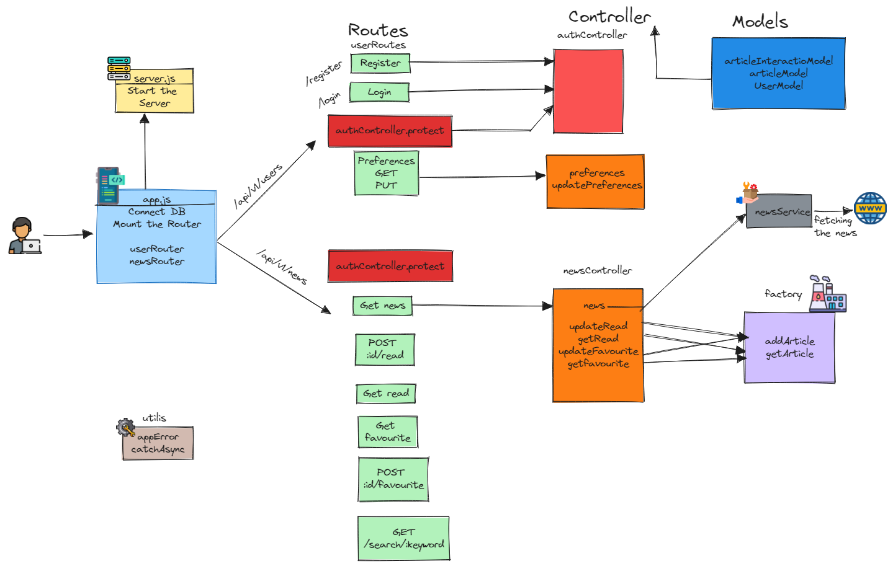

# One News (Backend)

# One News - Backend

The API will allow users to register, log in, and set their news preferences (categories, countries and languages). The API will then fetch news articles from external news APIs ([NewsDATA](https://newsdata.io/documentation/)). The fetched articles is processed and filtered asynchronously based on user preferences.

# Endpoints

- `POST /register`: Register a new user.
- `POST /login`: Log in a user.
- `POST /logout`: Log out the user.
- `GET /preferences`: Retrieve the news preferences for the logged-in user.
- `PUT /preferences`: Update the news preferences for the logged-in user.
- `GET /news`: Fetch news articles based on the logged-in user's preferences.
- `POST /:id/read`: Update the read based on article id.
- `GET /read` : Get the Read articles.
- `DELETE /:id/read`: Delete the article from the read resource.
- `POST /:id/favourite`: Update the favourite based on article id.
- `GET /favourite` : Get the favourite articles.
- `DELETE /:id/favourite`: Delete the article from the favourite resource.
- `GET /search/:keyword` : Search the news by the keyword

# Flow of Control

# Birds eye view of the app

# Built using

