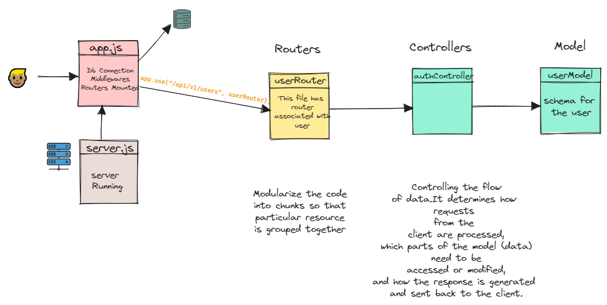
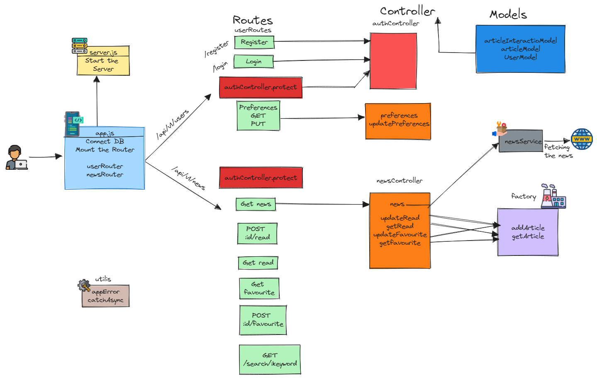

# One News - Backend

The API will allow users to register, log in, and set their news preferences (categories, countries and languages). The API will then fetch news articles from external news APIs ([NewsDATA](https://newsdata.io/documentation/)). The fetched articles is processed and filtered asynchronously based on user preferences.

# Endpoints

| Endpoint                | Description                                                    |
| ----------------------- | -------------------------------------------------------------- |
| `POST /register`        | Register a new user.                                           |
| `POST /login`           | Log in a user.                                                 |
| `POST /logout`          | Log out the user.                                              |
| `GET /preferences`      | Retrieve the news preferences for the logged-in user.          |
| `PUT /preferences`      | Update the news preferences for the logged-in user.            |
| `GET /news`             | Fetch news articles based on the logged-in user's preferences. |
| `POST /:id/read`        | Update the read status of an article based on its ID.          |
| `GET /read`             | Get the list of read articles.                                 |
| `DELETE /:id/read`      | Delete an article from the read resource based on its ID.      |
| `POST /:id/favourite`   | Update the favorite status of an article based on its ID.      |
| `GET /favourite`        | Get the list of favorite articles.                             |
| `DELETE /:id/favourite` | Delete an article from the favorite resource based on its ID.  |
| `GET /search/:keyword`  | Search for news articles by keyword.                           |

# Flow of Control

# Birds eye view of the app

# Built using

